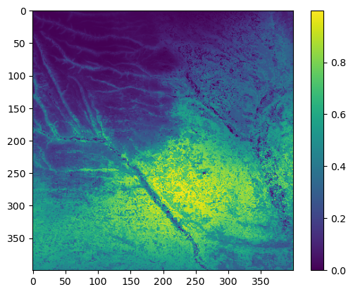
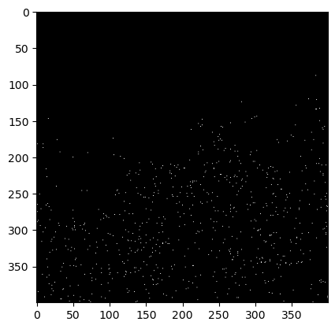
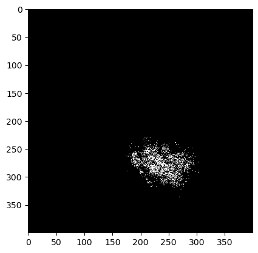

# EndOSim

EndOSim is a tool for simulating virtual species occurrence maps for use in species distribution modelling experiments.

## Setting up a simulation

To begin setting up a simulation, we need to load in a habitat suitability raster in ascii format. It is also important that when loading the raster that we also use the getHeader() function to save the file header. This is important for exporting the virtual species distributions to file after running the simulations.

The header for the file used here is 6 lines in length. This tells the getHeader() function how many lines to read and also how many lines to skip when reading the raster.


```julia
include("D:/git/SpatialVirtualSpecies/src/SpatialVirtualSpecies.jl")
using .SpatialVirtualSpecies
using DataFrames
using PyPlot

header = SpatialVirtualSpecies.getHeader("D:/PHDExperimentOutputs/Transferability/landscapes/suitability/suitability789.asc",6)
suitability = readdlm("D:/PHDExperimentOutputs/Transferability/landscapes/suitability/suitability789.asc",skipstart=6)

imshow(suitability)
colorbar()
```





    WARNING: replacing module SpatialVirtualSpecies.
    


    PyObject <matplotlib.colorbar.Colorbar object at 0x00000000C9A99820>


### Initialise the state layer (species occurrences)

Now we have our habitat suitability layer, we also need to initialise a state layer. The state layer is separate 2D matrix that can be either a zero or a one. If the state of a cell is set to one, then it is occupied by the virtual species, if it is zero then it is unoccupied.

In this example I have randomly set 1% of cells that have suitability values between 0.4-1.0 as occupied. 


```julia
pa = SpatialVirtualSpecies.generateStateLayer(suitability,0.01,(0.4,1.0))
imshow(pa,cmap="gray")
```


    PyObject <matplotlib.image.AxesImage object at 0x00000000DBDA0130>


### Define simulation parameters

Next we define a set of parameters for our simulation. To being with, we'll just use the simplest simulation and focus only on dispersal parameters. To do this, we define three parameters that control the mean number of dispersers from a cell, the probability that a cell will be selected for dispersal and the mean dispersal distance (measured in cells units).

To control the behaviour of how cells are selected for colonisation, a position selector (POS) constructor is created. In this example we will use an exponential function but a linear function is available or you can create your own (See XXX). 


```julia
# Create cartesian index 
paIdx = CartesianIndices(suitability)
# Define dispersal parameters
num_dispersers = 1
prob_dispersal = 0.2
dispersal_dist = 3.0
# Define POS parameter constructors
pos_params = SpatialVirtualSpecies.ExponentialPosSelector(dispersal_dist)
#Create simulation constructor
ca = SpatialVirtualSpecies.SpeciesCellularAutomataSuitabilityWeighted(pa,paIdx,suitability,suitability,pos_params,prob_dispersal,num_dispersers)
```


    Main.SpatialVirtualSpecies.SpeciesCellularAutomataSuitabilityWeighted([0.0 0.0 … 0.0 0.0; 0.0 0.0 … 0.0 0.0; … ; 0.0 0.0 … 0.0 0.0; 0.0 0.0 … 0.0 0.0], CartesianIndex{2}[CartesianIndex(1, 1) CartesianIndex(1, 2) … CartesianIndex(1, 399) CartesianIndex(1, 400); CartesianIndex(2, 1) CartesianIndex(2, 2) … CartesianIndex(2, 399) CartesianIndex(2, 400); … ; CartesianIndex(399, 1) CartesianIndex(399, 2) … CartesianIndex(399, 399) CartesianIndex(399, 400); CartesianIndex(400, 1) CartesianIndex(400, 2) … CartesianIndex(400, 399) CartesianIndex(400, 400)], [0.022343206378993 0.0134280695576249 … 0.0897643315075311 0.0927230529401432; 0.019478291615791 0.0170013455696422 … 0.0896817957509623 0.085463645911146; … ; 0.524523389725788 0.508403679771168 … 0.463930486668744 0.482077392915929; 0.503942571554174 0.434314934579188 … 0.45049946871293 0.476486220824685], [0.022343206378993 0.0134280695576249 … 0.0897643315075311 0.0927230529401432; 0.019478291615791 0.0170013455696422 … 0.0896817957509623 0.085463645911146; … ; 0.524523389725788 0.508403679771168 … 0.463930486668744 0.482077392915929; 0.503942571554174 0.434314934579188 … 0.45049946871293 0.476486220824685], Main.SpatialVirtualSpecies.ExponentialPosSelector(3.0), 0.2, 1)


Both the habitat suitabilty and state layers can be accessed through the cellular automata object (ca)


```julia
imshow(ca.suitabilityActive)
imshow(ca.pa,cmap="gray")
```





    PyObject <matplotlib.image.AxesImage object at 0x00000000C60ABAC0>


### Create a simulation function

With our parameters set up, we now need to define the simulation behaviour. For this example we will keep things simple and ensure that for each iteration we apply the colonise function and then the extinction function to our state layers.

You can modify the order of these functions or define your own function that modifies the suitability layer (e.g. temporal trends) or the state layer (e.g. disturbances)


```julia
function simulate(ca,iterations)
    for i in 1:iterations
        SpatialVirtualSpecies.colonise(ca)
        SpatialVirtualSpecies.extinction(ca)
    end
end  
```


    simulate (generic function with 1 method)


### Run the simulation

Now let's run the simulation for 200 timesteps and see what our virtual species distribution looks like


```julia
simulate(ca,200)
imshow(ca.pa,cmap="gray")
```





    PyObject <matplotlib.image.AxesImage object at 0x000000000A9F25E0>


### Write the outputs to file

Using the header we pulled out of the raster file at the start, we can then write this back into an ascii file.


```julia
open("F:/test_sim.asc","w") do io
    write(io,header)
    writedlm(io,ca.pa)
end
```
