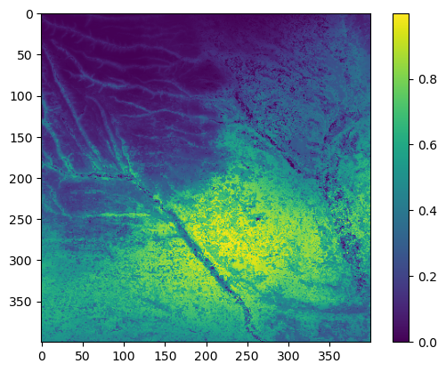
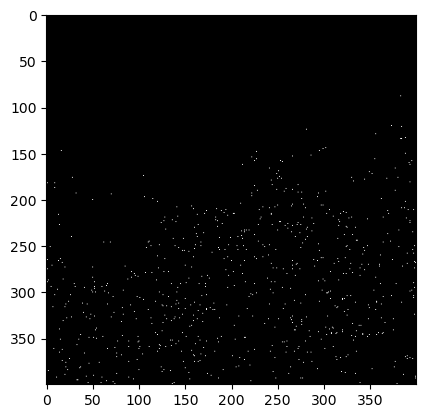
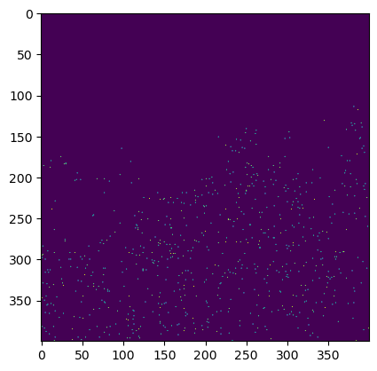
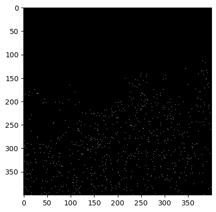

# SpatialVirtualSpecies

SpatialVirtualSpecies is a tool for simulating virtual species occurrence maps for use in species distribution modelling experiments.

## Dependencies
This tool requires the installation of Random, Distributions and StatsBase packages for Julia

## Setting up a simulation

The simulation requires three raster layers to control key functions and store the state variable.
#### State layer (Species occurrences)
This is a binary layer, with values representing an occupied state (1) and unoccupied state (0).
#### Survival control layer
This layer should have values ranging between zero and one, and is used to define the probability of persistence of the extinction function. The extinction function performs Bernoulli trials at occupied cells to determine whether they remain occupied into the next timestep
#### Dispersal control layer
They layer should also have values ranging between zero and one, and has two purposes. Firstly, it defines barriers for movement, with values equal to zero not able to be colonised. Secondly, they serve as a weighting for the number of colonisers that disperse from an occupied cell. Larger values resulting in greater numbers of colonisers.

The survival and dispersal control layers are stored as two versions, an active and passive layer. The active layer is used in the colonisation and extinction functions, that are used to update the state layer. The passive layer is initially identical to the actvie layer but allows users to make temporary updates to the active layer (e.g. add in some stochastic noise, disturbances or species interactions), by allowing users to revert back to the original suitability layer at the end of an iteration.

## Example
In this example, I have created a single habitat suitability map with values between zero and one that will serve as BOTH the survival and colonisation control layers. This basically means that in our simulation, the environment affects survival and colonisation to similar degree. Specifiying two different

It is also important that when loading the raster that we also use the getHeader() function to save the file header. This is important for exporting the virtual species distributions to file after running the simulations.

The header for the file used here is 6 lines in length. This tells the getHeader() function how many lines to read and also how many lines to skip when reading the raster.


```julia
include("../../src/SpatialVirtualSpecies.jl")
using .SpatialVirtualSpecies
using DataFrames,DelimitedFiles
using PyPlot

header = SpatialVirtualSpecies.getHeader("../../data/suitability_789.asc",6)
suitability = readdlm("../../data/suitability_789.asc",skipstart=6)

imshow(suitability)
colorbar()
```





### Initialise the state layer (species occurrences)

Now we have our habitat suitability layer, we also need to initialise a state layer. The state layer is separate 2D matrix that can be either a zero or a one. If the state of a cell is set to one, then it is occupied by the virtual species, if it is zero then it is unoccupied.

In this example I have randomly set 1% of cells that have suitability values between 0.4-1.0 as occupied.


```julia
pa = SpatialVirtualSpecies.generateStateLayer(suitability,0.01,(0.4,1.0))
imshow(pa,cmap="gray")
```





### Define simulation parameters

Next we define a set of parameters for our simulation. To being with, we'll just use the simplest simulation and focus only on dispersal parameters. To do this, we define three parameters that control the mean number of dispersers from a cell, the probability that a cell will be selected for dispersal and the mean dispersal distance (measured in cells units).

To control the behaviour of how cells are selected for colonisation, a position selector (POS) constructor is created. In this example we will use an exponential function but a linear function is available or you can create your own (See XXX).


```julia
paIdx = CartesianIndices(suitability)
# Define POS parameter constructors
pos_params = SpatialVirtualSpecies.ExponentialPosSelector(3)
# Define dispersal parameters
cp = SpatialVirtualSpecies.ColoniseParameters(pos_params,0.2)
#Create simulation constructor
ca = SpatialVirtualSpecies.SpeciesCellularAutomata(pa,paIdx,suitability,suitability)
imshow(ca.pa)
```





```julia
imshow(ca.survivalControl_Initial)
imshow(ca.pa,cmap="gray")
```





### Create a simulation function

With our parameters set up, we now need to define the simulation behaviour. For this example we will keep things simple and ensure that for each iteration we apply the colonise function and then the extinction function to our state layers.

You can modify the order of these functions or define your own function that modifies the suitability layer (e.g. temporal trends) or the state layer (e.g. disturbances)


```julia
function simulate(ca,iterations)
    for i in 1:iterations
        SpatialVirtualSpecies.colonise(ca,cp)
        SpatialVirtualSpecies.extinction(ca)
    end
end  
```


### Run the simulation

Now let's run the simulation for 200 timesteps and see what our virtual species distribution looks like


```julia
simulate(ca,200)
imshow(ca.pa,cmap="gray")
```


### Write the outputs to file

Using the header we pulled out of the raster file at the start, we can then write this back into an ascii file.


```julia
open("F:/test_sim.asc","w") do io
    write(io,header)
    writedlm(io,ca.pa)
end
```
